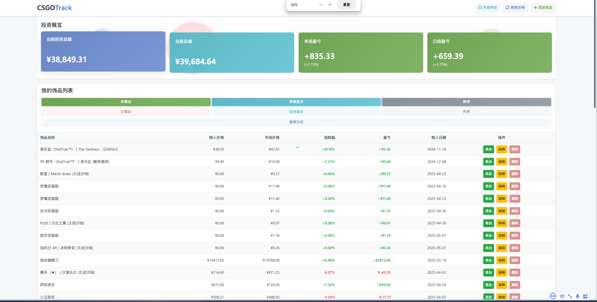
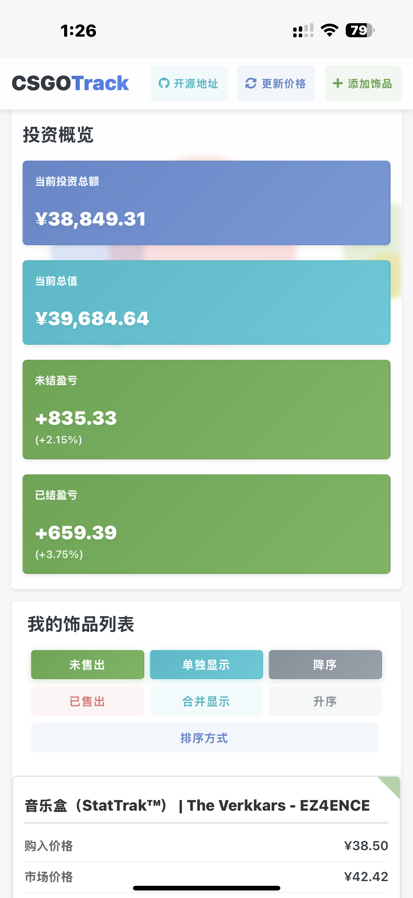

# CSGO-Track 饰品价格追踪系统

CSGO-Track 是一个专为 CS2 饰品投资者设计的价格追踪系统，帮助您实时监控饰品价格变化、管理投资组合以及分析盈亏情况。

## 🔍 主要功能

- **实时价格更新**：自动从多个平台（BUFF、C5、悠悠）获取最新价格
- **价格智能选择**：始终选择三个主要交易平台中最低的价格
- **投资组合管理**：跟踪所有饰品的购入价、当前价、持有时间等信息
- **盈亏分析**：直观显示每个饰品的涨跌幅、盈亏金额和比例
- **历史价格查看**：一键查看饰品在 SteamDT 上的历史价格走势
- **多平台适配**：支持 PC 和移动端，支持 PWA 应用安装到桌面

## 💻 技术栈

- 前端：HTML5、CSS3、JavaScript、Bootstrap 5
- 后端：PHP 7+、PDO MySQL
- 数据来源：SteamDT API
- 部署方式：支持 PWA 应用

## 🚀 快速开始

### 安装步骤

1. 将项目文件上传到您的网站根目录
2. 导入数据库文件夹中的 SQL 文件到您的 MySQL 数据库
3. 修改 `config.php` 文件中的数据库连接信息
4. 设置定时任务以自动更新价格和饰品信息

### 定时任务设置

为了保持价格数据和饰品信息的实时更新，请设置以下定时任务：

```bash
# 每分钟运行一次价格更新脚本
cd /您的网站目录 && php update_price.php

# 每天运行一次饰品基础信息更新脚本
cd /您的网站目录 && php fetch_base_info.php
```

## 🔧 配置说明

### 数据库配置

在 `config.php` 文件中配置您的数据库连接信息：

```php
define('DB_HOST', 'localhost');
define('DB_NAME', '您的数据库名');
define('DB_USER', '数据库用户名');
define('DB_PASS', '数据库密码');
```

### API 配置

价格数据来源于 SteamDT API，您需要在 `config.php` 文件中配置您的 API 令牌：

```php
define('STEAMDT_API_KEY', '您的API令牌');
```

## 📊 系统截图




## 📋 数据库结构

系统使用单一的 `skins` 表存储所有饰品信息，主要字段包括：

- 基本信息：id, name, marketHashName
- 价格信息：purchase_price, market_price, sold_price, fee
- 日期信息：purchase_date, sold_date, last_updated
- 状态信息：is_sold, quantity

详细的数据库结构可以在导入的 SQL 文件中查看。

## 🔄 价格更新逻辑

系统采用智能价格选择逻辑，从 BUFF、C5 和 悠悠有品) 三个主要交易平台中选择最低价格。

当某些平台没有特定饰品的价格时，系统会自动选择其他可用平台的最低价格。

## ⚙️ 自定义与扩展

您可以根据需要修改以下文件来自定义系统功能：

- `update_price.php`：调整价格更新逻辑和频率
- `fetch_base_info.php`：修改饰品基础信息获取方式
- `js/main.js`：自定义前端交互逻辑
- `css/custom.css`：调整界面样式

## 🤝 贡献指南

非常欢迎您对 CSGO-Track 项目做出贡献！您可以通过以下方式参与：

1. 提交 Issue：报告 bug 或提出新功能建议
2. 提交 Pull Request：贡献代码改进
3. 完善文档：帮助改进使用说明和文档

## 📄 开源许可

本项目采用 GNU General Public License v3.0（GPLv3）许可证。这意味着您可以自由使用、修改和分发本软件，但是：

- 任何基于本软件的衍生作品必须以相同的许可证发布
- 必须保留原始版权声明
- 您必须明确说明您对原始代码所做的任何更改

详细许可条款请参阅项目根目录下的 LICENSE 文件。

## 📞 联系方式

如有任何问题或建议，欢迎通过以下方式联系：

- GitHub Issues: [提交问题](https://github.com/ArtiSheng/CSGO-Track/issues)
- 电子邮件：cc@artisheng.vip
- QQ：3447478882
---

感谢您使用 CSGO-Track！希望这个工具能帮助您更好地管理您的 CS2 饰品投资。 